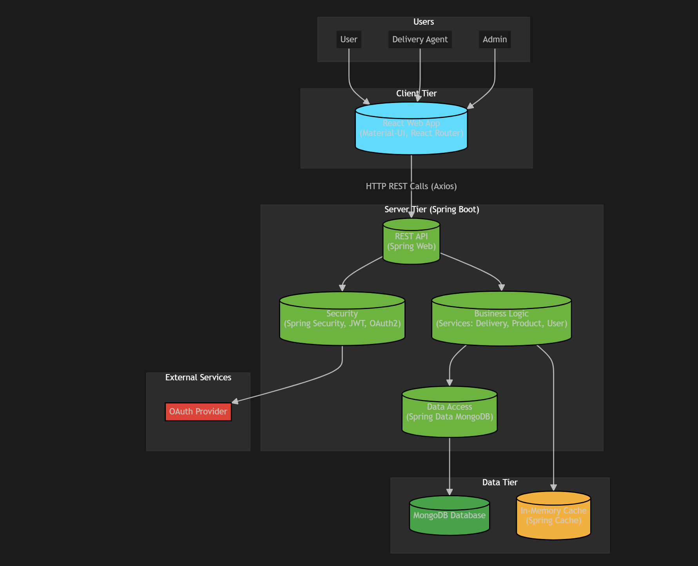

# DlVery - Delivery Management System

DlVery is a comprehensive delivery management system designed for inventory and delivery teams to efficiently manage product deliveries.

## Features

- **User Management**: Register and manage users with different roles (Inventory Team, Delivery Team)
- **Product Management**: Track products with categories, SKUs, and inventory levels
- **Delivery Management**: Create, assign, and track deliveries with different statuses and priorities
- **Inventory Tracking**: Monitor inventory transactions including stock-in, stock-out, returns, and damaged items
- **Reporting and Analytics**: Generate reports on delivery performance, inventory levels, and user activity
- **Notifications**: Real-time updates on delivery status and inventory changes
- **Role-Based Access Control**: Secure access to features based on user roles

## Technologies Used

### Backend

- **Spring Boot**: Framework for building robust, production-ready applications
- **Java 21**: Programming language
- **Spring Security**: Authentication and authorization
- **JWT (JSON Web Tokens)**: Securely transmitting information between parties
- **MongoDB**: NoSQL database for flexible data storage
- **Spring Data MongoDB**: Spring-based data access for MongoDB
- **Lombok**: Boilerplate code reduction
- **Springdoc OpenAPI**: API documentation generation

### Frontend

- **React**: JavaScript library for building user interfaces
- **Vite**: Fast build tool for modern web projects
- **Material-UI**: React components for faster and easier web development
- **Axios**: Promise-based HTTP client for the browser and Node.js
- **React Router DOM**: Declarative routing for React
- **Formik**: Building forms in React
- **Yup**: JavaScript schema builder for value parsing and validation

## Architecture

The application is designed with a modern, multi-tiered architecture that separates concerns and enhances scalability. It consists of a client tier, a server tier, a data tier, and external services for authentication.



### Architectural Components

-   **Client Tier**: The frontend is a single-page application built with **React** and **Vite**. It uses **Material-UI** for components and **React Router** for navigation. All communication with the backend is handled via RESTful API calls using **Axios**.

-   **Server Tier**: The backend is powered by **Spring Boot** and is responsible for the core application logic.
    -   **REST API**: Built with **Spring Web**, this layer exposes endpoints for the client to consume.
    -   **Security**: **Spring Security** handles authentication and authorization. It uses **JWT** for session management and supports **OAuth2** for third-party authentication with providers like Google or GitHub.
    -   **Business Logic**: This layer contains the service classes (e.g., `DeliveryService`, `ProductService`) that implement the application's features.
    -   **Data Access**: **Spring Data MongoDB** provides a simplified abstraction for interacting with the MongoDB database.

-   **Data Tier**:
    -   **MongoDB Database**: A NoSQL database used as the primary data store for the application, offering flexibility and scalability.
    -   **In-Memory Cache**: **Spring Cache** is used to implement an in-memory cache, reducing database load and improving response times for frequently accessed data.

-   **External Services**: The application integrates with external **OAuth Providers** to offer social login options, enhancing user convenience and security.

## Low Level Design

The following sequence diagram illustrates the flow of a typical `GET` request to retrieve a product by its ID. This demonstrates the interaction between the client, security filters, and the different layers of the backend (Controller, Service, Repository).


### Request Flow Breakdown:

1.  **Client Request**: The process begins when the **Client (React App)** sends a `GET /api/products/{id}` request to the backend.
2.  **Authentication Filter**: The `JwtAuthenticationFilter` intercepts the incoming request. It validates the JWT included in the request headers to ensure the user is authenticated.
3.  **Forward to Controller**: Once the token is validated, the filter forwards the authenticated request to the `ProductController`.
4.  **Controller Logic**: The `ProductController` receives the request and calls its `getProductById(id)` method. It then delegates this task to the `ProductService`.
5.  **Service Layer**: The `ProductService` calls the `findById(id)` method on the `ProductRepository` to fetch the data.
6.  **Repository & Database**: The `ProductRepository` constructs and executes a `findOne({_id: id})` query against the **MongoDB** database.
7.  **Data Retrieval**: MongoDB returns the corresponding product document to the repository.
8.  **Model Mapping**: The repository maps the document to a `Product` model and returns it to the service, which then returns it to the controller.
9.  **DTO Wrapping**: The `ProductController` wraps the `Product` model inside an `ApiResponse` object (a Data Transfer Object pattern) to standardize the API response.
10. **Client Response**: Finally, the controller sends a `200 OK` response back to the client, containing the `ApiResponse` with the product data.

## Getting Started

Follow these instructions to set up and run the DlVery application on your local machine.

### Prerequisites

- Java Development Kit (JDK) 21 or higher
- Node.js (LTS version recommended)
- npm or Yarn
- MongoDB instance (local or cloud-based)

### Backend Setup

1. **Clone the repository**:

   ```bash
   git clone https://github.com/your-username/DlVery.git
   cd DlVery/backend/DlVery
   ```

2. **Configure MongoDB**:

   Update `src/main/resources/application.properties` (or `application.yml`) with your MongoDB connection details:

   ```properties
   spring.data.mongodb.uri=mongodb://localhost:27017/dlverydb
   ```
   Replace `mongodb://localhost:27017/dlverydb` with your MongoDB URI.

3. **Build and Run the Backend**:

   ```bash
   ./mvnw clean install
   ./mvnw spring-boot:run
   ```

   The backend server will start on `http://localhost:8080`.

### Frontend Setup

1. **Navigate to the frontend directory**:

   ```bash
   cd ../../frontend/dlvery-frontend
   ```

2. **Install dependencies**:

   ```bash
   npm install
   # or yarn install
   ```

3. **Run the Frontend**:

   ```bash
   npm run dev
   # or yarn dev
   ```

   The frontend development server will start on `http://localhost:5173` (or another available port).

## Usage

Once both the backend and frontend are running:

1. Open your web browser and navigate to `http://localhost:5173`.
2. Register a new user or log in with existing credentials.
3. Explore the features for managing users, products, and deliveries.
